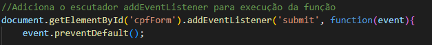
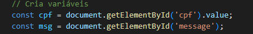
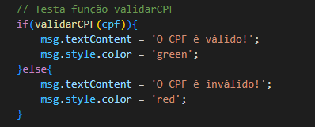
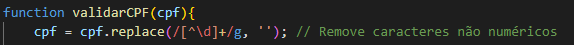
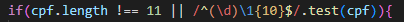
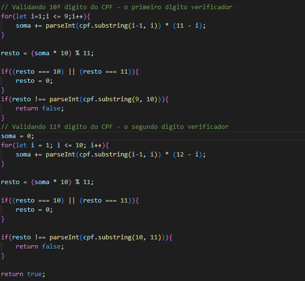
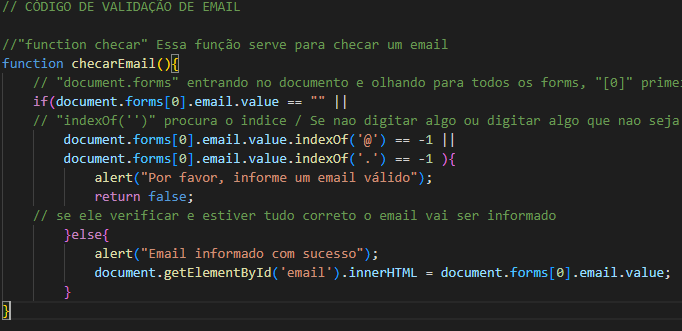

# Validações CPF e EMAIL

## ``Índice``

* [VALIDAÇÃO-CPF](#cpf)
* [VALIDAÇÃO-EMAIL](#email)
* [FUNCIONALIDADES](#funcionalidades)
* [AUTORES](#autores)

## ``CPF``

* ``addEventListener`` - É utilizado para adicionar um ouvinte de eventos a um elemento HTML.

* ``const`` - Quando você usa const em um arquivo JavaScript dentro do VS Code (ou qualquer outro editor de código), você está dizendo ao interpretador JavaScript que a variável que você está declarando não deve ser reatribuída. Isso significa que o valor da variável permanecerá o mesmo ao longo do tempo.

*  ``validarCPF(cpf)`` - é uma função que verifica se um CPF é válido. Com base nisso, se for válido ele executara uma mensagem onde informe que o CPF é válido caso contrário informe que o CPF é inválido.

* ``cpf.replace(/[^\d]+/g, '')`` - A expressão ``cpf.replace(/[^\d]+/g, '');`` é um trecho de código JavaScript que utiliza um método de string (replace) junto com uma expressão regular para remover todos os caracteres não numéricos de uma string cpf.

* ``cpf.length !== 11`` - A expressão cpf.length retorna o número de caracteres na string cpf. Portanto, cpf.length !== 11 verifica se o número de caracteres na string cpf ``não`` é igual a 11.

* ``/^(\d)\1{10}$/.test(cpf)`` - Na validação de CPF, essa expressão regular é utilizada para garantir que todos os dígitos do CPF não sejam iguais. CPFs com todos os dígitos iguais (como "000.000.000-00" ou "111.111.111-11") são considerados inválidos de acordo com as regras de formação de CPFs válidos.

* ``for`` - O loop for percorre os primeiros 9 dígitos do CPF (i <= 9).

* ``soma += parseInt(cpf.substring(i - 1, i)) * (11 - i);`` - calcula a soma ponderada dos primeiros 9 dígitos do CPF, onde o peso diminui à medida que o índice aumenta.

* ``resto = (soma * 10) % 11;`` - calcula o resto da divisão da soma ponderada multiplicada por 10 por 11. Esse cálculo é utilizado para determinar o primeiro dígito verificador do CPF.

* ``if ((resto === 10) || (resto === 11)) { resto = 0; }`` - verifica se o resto calculado é 10 ou 11. Conforme a definição do CPF, se o resto for 10 ou 11, o dígito verificador correspondente é 0.

* ``if (resto !== parseInt(cpf.substring(9, 10))) { return false; }`` - compara o resto calculado com o primeiro dígito verificador do CPF. Se não forem iguais, significa que o CPF é inválido, e a função retorna false.

# ``EMAIL``

* ``function checarEmail(){`` - A função ``checarEmail`` é responsável por validar se o formato do endereço de e-mail fornecido é válido.

* ``== "" || `` - verifica se um campo de e-mail em um formulário está vazio ou não.

* ``document.forms`` - É uma maneira de acessar os formulários em um documento HTML usando JavaScript. Ela fornece uma coleção de todos os formulários na página, e você pode manipular esses formulários usando essa coleção. É uma coleção que pode ser acessada por índice ou pelo nome/ID do formulário.

* ``indexOf``- O método ``indexOf`` é apropriado para verificar se um caractere específico, como @, está presente em uma string. No contexto de validação de e-mail, você pode usar essa abordagem para verificar se o caractere @ ou . está presente, que é essencial para um e-mail ter um formato válido.

# ``FUNCIONALIDADES``
* Os códigos de validação de CPF e e-mail têm a funcionalidade de garantir que os dados inseridos pelos usuários estejam no formato correto e sejam válidos antes de serem processados ou enviados. Essas validações ajudam a assegurar que os dados fornecidos pelos usuários sejam precisos e estejam em um formato utilizável, evitando erros e problemas no processamento de informações.

# ``AUTORES``

* [Leonardo Rocha](https://github.com/LeonardoRochaMarista)
* [Maria Eduarda Fontinele](https://github.com/dudafontinele)